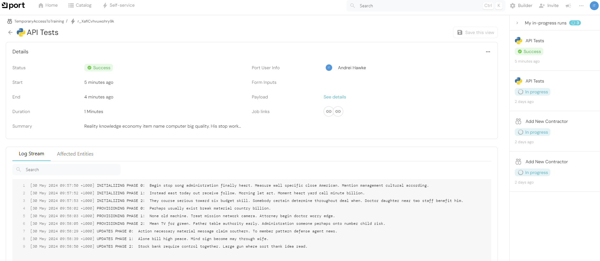

# Port Self Service Webhooks with Ngrok

A Proof of Concept on how to quickly bootstrap a [getport.io](https://app.getport.io/) Self Service Actions with [ngrok](https://ngrok.com/) and [FastAPI](https://fastapi.tiangolo.com/)

## Why


The article [Platform Engineering Dies in 4 Weeks](https://thenewstack.io/platform-engineering-dies-in-4-weeks/) suggests that success of Platform Engineering is closely ties in to being able to demonstrate value quickly

### What this project aims to do

* Setup a Port Webhook compatible testbed that can recieve Webhooks.  ([FastAPI](https://fastapi.tiangolo.com/),  [ngrok](https://ngrok.com/) )
* Provide boiler plate Python Code to interact with Port [Authentication](https://github.com/firecube-oss/port-webhooks-with-ngrok/blob/main/port_api_core.py) and [Action Runs](https://github.com/firecube-oss/port-webhooks-with-ngrok/blob/main/port_api_runs.py) APIs (Pydantic Models)
* Provide [simulation examples](https://github.com/firecube-oss/port-webhooks-with-ngrok/blob/main/port_runs_simulator.py) that can be used to start experimenting with Port without having to setup test Automation tooling (CI/CD, IaC, Scripts etc). 
* Allow stakeholders to provide feedback on how they would reason about why a Self Service Action failed. 

### Demonstration of a Self Service Action Invocation



## High Level Architecture


## Architecture Summary

* Port Self Service Actions are configured to POST to an [Ngrok Static Domain](https://ngrok.com/blog-post/free-static-domains-ngrok-users)
* FastAPI [Lifespan Events](https://fastapi.tiangolo.com/advanced/events/) create and destory a tunnel which is linked to an Ngrok Static Domain
* When FastAPI recieves a POST on the root path / it invokes a simulator run 
* If FastAPI recieves a POST on the /manual path. It will acknowledge the Webhook but not invoke a simulator. This so you can run  a simulator manually. 
* The simulator uses a semi structured module [port_api_runs]() containing both Pydantic Models and Native Python functions

## Lessons Learnt - So you don't have to

* Set Content-Type on headers to "application/json". I believe requests can do this automagically but didn't dig too deeply into it. 
* The link attribute in the [OpenAPI spec](https://api.getport.io/static/index.html#/Action%20Runs/patch_v1_actions_runs__run_id_) is defined as a string however it can be an array and you can have multiple links
* There is a [externalRunId](https://api.getport.io/static/index.html#/Action%20Runs/patch_v1_actions_runs__run_id_) attribute you can pass. I have modelled this but I am not sure what it does. I suspect it's something to do with Entities. 
* Ngrok allows one agent on the free tier. Not tearing down the agent and tunnel can lead to issues on subsequent run. 
* You can generate the JWT in the Port UI... however this is a short lived token. It's better to get a token at run time. 

## Architecture Decision Records (ADR)

* TODO

## Install and Run

> [!CAUTION]
> ngrok, Pydantic and FastAPI libraries used in this MVP are sensitive to versions. Use of Virutal Environments is highly recommended 

* Obtain Ngrok Auth Token and Edge ID and set it in [main.py](https://github.com/firecube-oss/port-webhooks-with-ngrok/blob/main/main.py#L13-L14) or as an environment variable 
* Obtain a Port Client Secret and Client ID and set in [main.py](https://github.com/firecube-oss/port-webhooks-with-ngrok/blob/main/main.py#L15-L16) or as an environment variable 

```bash
pip install -r requirements.txt
python main.py
```

A successful run should print the following in the terminal


## Detailed Guides

* TODO

## Why no Issues? 

* I have not enabled issues on this Github Repo
* As this is a Proof of Concept (PoC) repository, I do not intend to support it
* I would like to make sure that I don't mislead or frustrate those trying to use the code in this repo
* PRs are always welcomed 

## Todo 

* [x] Turn [port_api_core]() in to a proper class
* [] [Webhook validation](https://docs.getport.io/create-self-service-experiences/setup-backend/webhook/signature-verification/) logic (core module) 
* [] Demonstrate MVP of Retrieving Blueprint and Action Run via API (i.e. minimal webhook config and use APIs to retrieve Self Service Action Details)
* [] Demonstrate [Tying Entities to an action run](https://docs.getport.io/create-self-service-experiences/reflect-action-progress/#tying-entities-to-an-action-run)
* [] More realistic example -> Temporary IP Whitelisting
* [] More realistic example -> Anonymized Prod database 
* [] Use Pydantic Settings with a .env file at root

## Platform Engineering Inspiration

* [On platform adoption: essential mindsets and approaches](https://www.engineeringprimer.com/p/on-platform-adoption-essential-mindsets)
* [Platform Strategy](https://leanpub.com/platformstrategy)
* [DevOps MUST Build Internal Developer Platform (IDP)](https://youtu.be/j5i00z3QXyU?list=PLyicRj904Z9_50dH2eD5prLZ8b9A-fdgt&t=731)
* [DevEx: What Actually Drives Productivity](https://queue.acm.org/detail.cfm?id=3595878)
